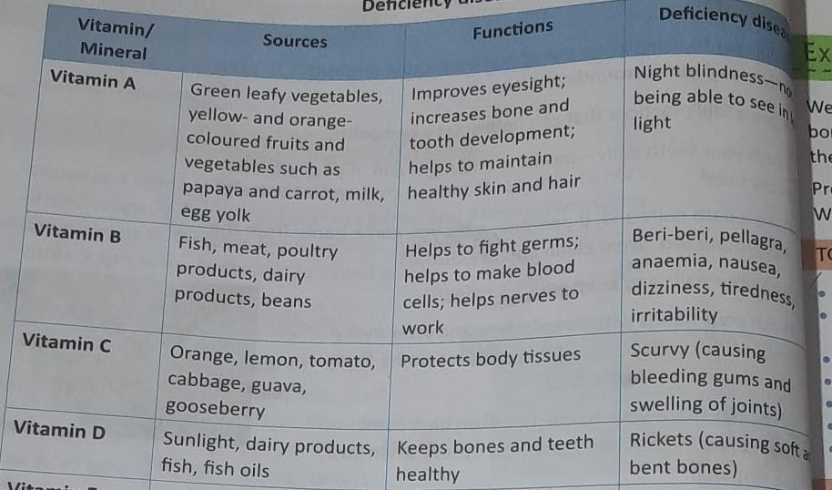
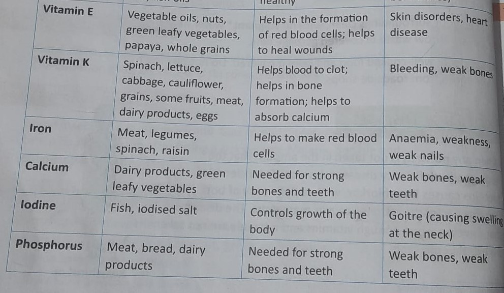
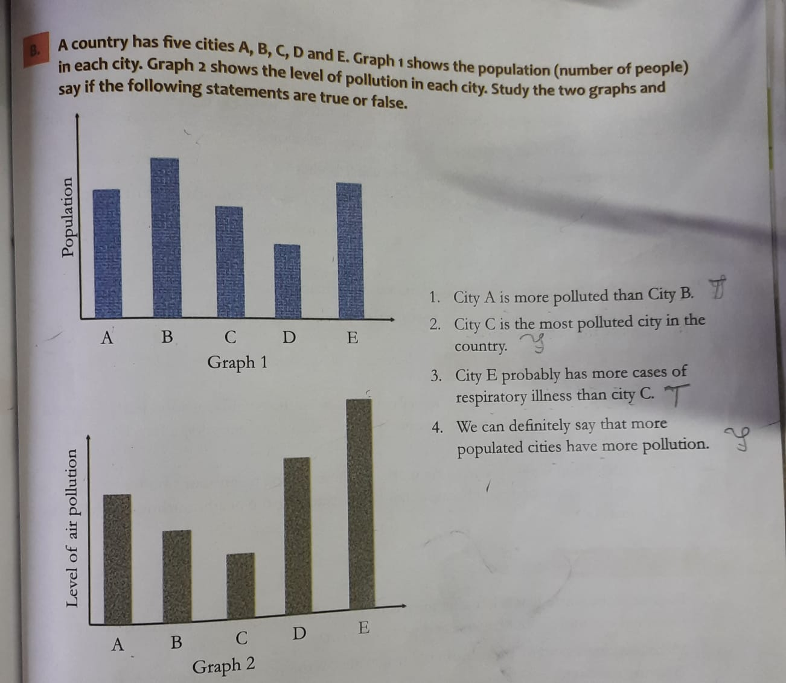
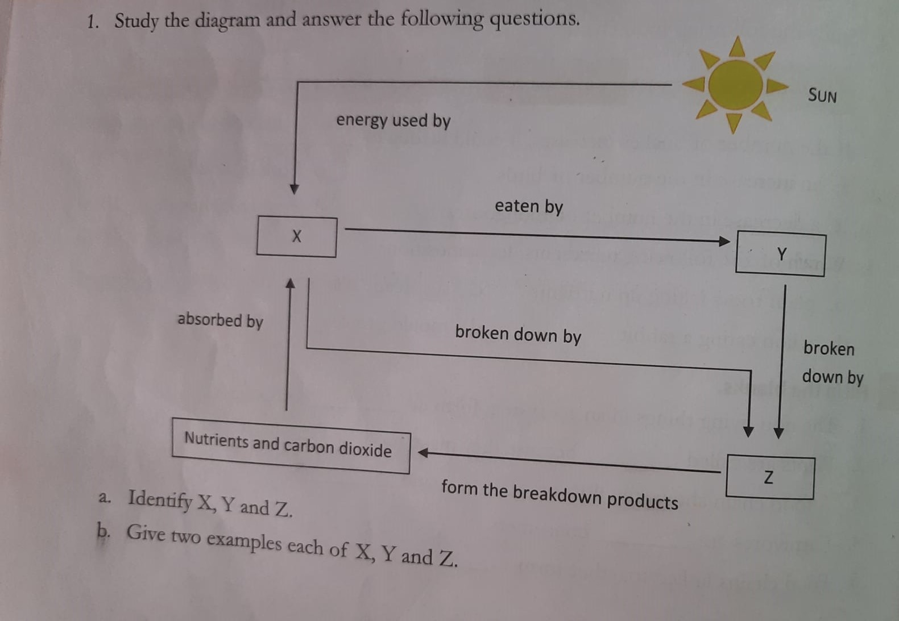
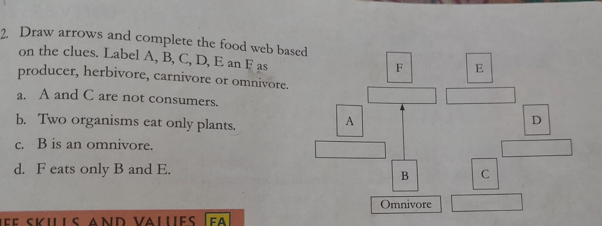

class: inverse, center, middle
```{r include = FALSE}
# https://pkg.garrickadenbuie.com/xaringanthemer/articles/xaringanthemer.html
# install.packages("remotes")
# remotes::install_github("gadenbuie/xaringanthemer")
library(xaringanthemer)


# devtools::install_github("lbusett/insert_table") # https://lbusett.netlify.app/post/a-new-rstudio-addin-to-facilitate-inserting-tables-in-rmarkdown-documents/
library(inserttable)

xaringanExtra::use_panelset() # for creating panelset or tab within a slide: Create a .panelset[] containing a .panel[] that itself has a .panel-name[]

style_duo(primary_color = "#1F4257", secondary_color = "#F97B64", 
        header_font_google = google_font("Josefin Sans"),
  text_font_google   = google_font("Montserrat", "300", "300i"),
  code_font_google   = google_font("Fira Mono")  )

```


# Chapter 2: Animal Adaptations

---
# Matching ggplot Themes

xaringanthemer even provides a [ggplot2] theme with theme_xaringan() that uses the colors and fonts from your slide theme. Built on the showtext package, and designed to work seamlessly with Google Fonts.

Color and fill scales are also provided for matching sequential color scales based on the primary color used in your slides. See ?scale_xaringan for more details.

More details and examples can be found in vignette("ggplot2-themes").

---
```{r , echo=FALSE}
library(ggplot2)
ggplot(diamonds) +
  aes(cut, fill = cut) +
  geom_bar(show.legend = FALSE) +
  labs(
    x = "Cut",
    y = "Count",
    title = "A Fancy diamonds Plot"
  ) +
  theme_xaringan(background_color = "#FFFFFF") +
  scale_xaringan_fill_discrete()
```

---
# To Sum Up

- Animal that live in a particular habitat share common adaptations. 
- Body covering like fur, feather, scales and shells protect animal. 
- Noses, blowholes, lungs, gills and spiracles are some of the breathing organs found in animals. 
- Animals move using legs, muscles, scales, webbed feet, fins, slippers or wings. 
- Animals travel long distance for warmth and food and to have young ones. 
- Animals have different body parts suited to their feeding habits. 

---

# Test Your Learning

- **A. Choose the correct answer**
  1. Which of the followings doesn't have fur on its body?
  
      a. yak
      b. ship
      c. mountain goat
      d. **fish**

  2. The polar bear and the Arctic fox have white fur during winter. Which of the following is the white color of the fur useful for? 
  
      a. to attact attention
      
      b. help them find other of their kind
      
      c. to keep them warm
                                                                                              
      d. **to help them hide in the snow**

  3. Which of the following groups has animals that do not breathe in the same way
  
      a. cockroach, ant, butterfly
      
      b. **shark, tadpole, dolphin**
      
      c. dog, horse, goat
      
      d. parrot, crow, eagle
      
  
---


  4. Which of the following pairs has animals that move in the same way? 
  
      a. shark and lizard
      
      b. ** zebra and horse**
      
      c. crow and caterpillar
      
      d. bear and snake
      
      
  5. Which of the following animals migrates for water? 
  
      a. whale
      
      b. rindeer
      
      c. siberian crane
      
      d. **wildebeest**


---

B. Study the flow chart. Give examples of animals A, B, C, D.

```{r}
knitr::include_graphics("img/chap2-science-img1-ABCD.jpeg")
```

Examples of Animals A: 


Examples of Animals B: 


Examples of Animal C: 


Examples of Animal D: 


      
  
---

C. Study the diagram and answer the following questions. 

  1. Where would you probably find animal A ? 
  
  Answer: 
  
  2. What are the likely eating habits of animal B ?
  
  Answer: 
  
  3. Give two examples each of animals A and B.
  
  Answer: 
  
  
---

D. Answer the following questions.

  1. What are the types of body coverings that animals have? Give an example of each type. 
  
  The animals have following types of body coverings
  
  - Fur or hai: Animals that live in cold places have fur or hair that help them to keep warm. e.g. 
  sheep, yak and mountain goats are mountain animals that have thick fur. The polar bear and Arctic fox, which live in the Arctic region, also have thick fur. 
  
  - Feathers: The feathers of birds help them fly and also protect them against the dust and cold. 
  
  - Scales: Animals like fish and snakes have scals on their skin to protect themselves. 
  
  - Shell: Animals such as snails, tortoises and turtles have a hard outer shell to protect their soft bodies. 
  
  
  
  2. List two reasons why animals migrate? 
  
  Animals migrate for food and water, they also migrate to go to warmer places to escape winter. 
  
---
  
  3. Explain the following terms: a. habitat b. spiracle
  
  Habitat: The natural surroundings in which an animal lives comfortably is known as its habitat. 
  
  Spiracle: Spiracles are Small holes on the bodies of insect through which they breathe. 
  
  
  4. Difference between herbivores, carnivores and omnivores.
  
  Herbivores: Animals that eat only plants and plant products are called herbivores. e.g. Cow, deer, zebra
  
  Carnivores: Meat eating animals are called carnivores e.g. tiger and wolf, eagle, owl
  
  Omnivores: Animals that each both plant/plant products and meat  are called omnivores. e.g. human beings, bears, crows
  
  5. Describe the type of teeth in herbivores. 
                                                                                             
Herbivores have sharp front teeth and broad back teetch to cut and chew grass. Examples are the cow, deer and zebra. 

---

class: inverse, center, middle

# Chapter 3: Food, Health And Hygiene

---
# To Sum Up

- A balanced diet is necessary for good health. 

- Carbohydrates and fats give us energy while proteins help to repair the worn out tissues
of our bodies. Vitamins and minerals protect us from illness. 

- Roughage and water are important parts of a balanced diet. 

- We must cook and preserve food in such a way that nutrients are not lost. 

- Diseases can either communicable  or non-communicable 

_ Lack of nutrients in the diet causes deficiency diseases. 

- Hygiene and exercise are a must for a healthy lifestyle. 


---
# Test your learning

1. Fr
---

# B. Say wheter the following sentences are true or false. Correct the false statements. 


---


# C. Answer the following questions

What are the types of nutrients present in food? Give two examples of food rich in each type of nutrient. 

Different types of nutrients present in food are-

carbohydrates- They provide energy 
Eg:Rice,wheat, potato

Proteins-they help the body to grow and repair worn out tissues:  milk and dairy products, legumes (dals and beans), poultry products (chicken and eggs)

Fats-to store energy. e.g. oils, meat, dairy products like butter and ghee and cheese, fish, poultry products and nuts. 

Vitamins and minerals protect us from diseases. Our body needs vitamins A, B, C, D, E and K. Iron, calcium, phosphorous and iodine are four important minerals. Vitamins and minerals are found in fresh fruits and vegetable, diary products, eggs and fish. 

2. Why are proteins important? 


---

3. What are the communicable disease ? How do they spread? Give four example of communicable diseases. 

Answer: Communicable diseases also called infectious diseases can spread from one person to another. They can spread in many ways
- through infected food and water
- through direct contact
- through air
- through insects
- through damanged skin

Examples of communicable diseases include cold, flu, measles, malaria, typhoid and tuberculosis. 


4. Discuss four activities you would include in your personal hygiene

 - Brush twice a day
 - Bath ever morning
 - wash your hand with soap before every meal
 - eating clean well cooked healthy food and keeping it covered
 - trim  nails and keep them clean
 - keep my hair clean

5. Explain the function of minerals in the body. What are diseases caused by the deficiency of minerals? 


---
# Deficiency Diseases Chart

```{r}

```


---


```{r}

```


---
class: inverse, center, middle

# Chapter 5: The Nervous System

---
# To Sum Up

- The nervous system controls all the organs in our body. 

- It is made of the brain, the spinal cord and the nerves. 

- The brain is made up of the cerebrum, the cerebellum and the medulla. 

- Nerves carry messages to an from the brain and spinal cord. 

- There are three types of nerves - sensory, motor and mixed. 

- Reflex actions are automatic reactions of our body. The breain is not involved. 

- Our sense organs supply us with information about our surroundings. 


---

# Test Your Learning

## A. Choose the correct answer 

1. The part of the brain that is responsible for learning is the (a. cerebrum). 

2. Information is carried to the brain by (c. sensory organ). 

3. In reflex actions, the (a. brain ) has/have no role. 

4. In dim light, the size of the pupil ( c. decreases ). 

5. Images of objects are formed on the ( c. retina ). 

## B. Fill in the blanks

1. The brain is protected by (the bones of the skull), while the spinal coord is protected by the (vertebral column ). 

2. The ( motor nerves ) carry messages to the muscles. 

3. Reflex actions are controlled by the  (spinal cord ). 

---
## Contd...

4. The (cerebellum ) helps to maintain the balance of the body. 

5. The tongue has (taste buds ) that can sense different tastes. 

## Name the following

1. The largest part of the brain : (cerebrum ) 

2. The other name of a nerve cell : (neurons )

3. The nerves that carry messages from the sense organs to the brain and also from the brain to 
the sense organs: (sensory nerves)

4. The thin structure that moves up and down in the ear: (eardrum)

5. The largest sense organ in the body: (skin)


---

## D. Answer the following questions

1. Name the three organs of the nerves system that control information. 


        i. Sensory Nerves
        
        ii. Motor Nerves
        
        iii. Mixed Nerves


3. What are parts of the brain? Explain their functions. 

The parts of the brains are 

    i. The Cerebrum: It is the thinking part and controls voluntary movement, learning, intelligence and memory. It also helps us to understand the signals that we get from the sense organs. 
  
    ii. The Cerebellum: It is in charge of movement and helps to maintain the balance of the body. 
  
    iii. The Medulla: It controls the heartbeat, breathing, blood circulation, digestion and other involuntary actions like sneezing, swallowing and so on. 

4. Explain the difference between sensory and motor serves. 

Sensory Nerves: These nerves carry messages from the muscles and sense organs to the brain or spinal cord. The brain undestands what the organ has seen, heard, felt, smelt or tasted. 

Motor Nerves: These nerves carry messages from the brian or the spinal cord to the muscles. The brain instructs the muscles on how to act. For example, if your hands are cold, the brain sends a message that makes you put your hands in your pocket. 

5. Explain reflex action with an example. 

When we accidentally touch something hot, we automatically draw our hand back. such actions that we perform without thinking are examples of relex actions. 


6. Draw a neat, labelled diagram of the eye. 

---
class: inverse, center, middle

# Chapter 8: Soil and Its Importance

---
## To Sum UP

- Soil is an important natural resource. 

- It is formed by the weathering of rocks over a long period of time. 

- Soil is very important to both plants and animals. 

- Sand, clay and loam are the basi types of soil found in nature. 

- The soil in any area has three layers: topsoil, subsoil and bedrock or parent rock. 

- Soil erosion takes place when the topsoil is washed away due to natural and human factors. 

- We must conserve soil by using methods like afforestation, terrace farming, contour ploughing and planting shelter belts. 


---

## Test Your Learning

1. Weathering of rocks is _____________

a. the breaking up of rocks into smaller pieces. 

2. The part of the soil that is made of decayed plant and animal material is 

d. humus

3. The type of soil that holds a large amount of water is 

b. loam

4. An activity that leads to soil erosion is 

b. cutting trees

5. Which of the following will stop soil erosion

b. planting more trees and plants


---
## Answer the following questions

1. List the things that social contains.

Answer: Soil contains the following things
        - rocks and minerals
        - dead and broken plants and  animals (make soil fertile. 
          This material is called ***humus***)
        - water and air
        - small worms and insects
        - small organisms like bacteria
        

2. Why is loamy soil used for growing plants? 

Loamy soil is made of sand, silt and clay. Since it holds water and nutrients better than sandy social and drains better than calyey soil, it is often used for growing plans, gardening and agriculture. 


---

3. What are the layers of soil? Explain their properties with a diagram

There are there layers of soil

- Topsoil : It is the topmost layer of soil and has sand and clay. It is rich in humus. It has many nutrients and holds water. It also contains air. 

- Subsoil: this layer contains pieces of rock and is less humus. It has less water and air than top soil. 

- Bedrock : This layer (also called **parent rock**) is mainly made up of large pieces of rock. Bedrock supports the upper layers of the soil. 


---

4. How have humans increased soil erosion? 

Human have increase social erosion by deforestation i.e. cutting down trees, overgrazing by cattle and ploughing of farmlands. 


5. How can soil be conserved

Soil  can be conserved by the following methods

- Afforestation i.e. by planting more trees. 

- Using soil cover by growing grass or covering the land by dry grass.

- Contour ploughing: It is a method of ploughing that follows the curves of the land. This slows the water flowing down and stops the soil from being washed away. 

- Terrace farming : It is practised on the slopes of the mountain. Fields are cut into the sides of mountains to look like step. These steps slow the flow of water down the slope, preventing soil erosion. 

- Growing shelter belts: Bushy plants are grown along the edges of fields to stop the wind from blowing away the soil. 

---
class: inverse, center, middle
# Chapter 11: Nature Links
---
## To sum up
- The biosphere is the part of the Earth where there are living things. 

- The ecosystem is made up of group of interacting organisms and their environments. 

- An ecosystem has a biotic and abiotic compoments. 

- Food chains link plants and animals according to their feeding habits. 

- A food chain can be used to trace the flow of energy. 

- Producers provide energy to all living things directly or indirectly. 

- Consumers do not make their own food. 

- All dead plants and animals matter is broken down by decomposers. 

- Two or more food chains link together form a food web. 

---
## Choose the correct answer

1. Which of the following does/do not depend on air? 

a. plants __b. sunlight__ c. animals d. bacteria

2. Identify the group that contains a producer, a consumer and a decomposer

a. grass, rabbit, eagle 
b. papaya plant, caterpillar, bird 
c. sugarcane, lizard, fungus 
d. grain, rat, snake

3. Which of the followings eats both plants and animals

a. rabbit  b. bear  c. eagle  d. deer

---
class: inverse, center, middle
# Chatper 12: Natural Disasters

---
## To Sum Up

- Natural disasters are natural events that cause great damage to life and property. Examples are earthquakes, tsunami, cyclones, floods and droughts. 

- Earthquakes are caused by the sudden movement of plates in the Earth's crust. 

- Tsunamis are caused by earthquakes or volcanic eruptions under the sea. 

- Heavy rains and melting snow cause water from water bodies overflow into nearby land, causing floods. 

- Droughts occur when a region does not get enough rainfall for a long time. 

- The government and each of us should take steps during and after a diaster to lessen its impact. 

---
## A. Choose the correct answer

1. The Earth's crust is made of many pieces called .......

     **a. plates**
     
     b. faults 
     
     c. aftershocks 
     
     d. tsunamis

2. Which of the followings cannot  be caused by an earthquake? 

    a. landslide 
    
    b. tsunami 
    
    c. cyclone 
    
    d. flood


  
---

3. Which of the following is not a name for a storm? 

  a. hurricane
  
  b. typhoon
  
  c. cyclone
  
  d. tsunami
  
4. __________ are built to prevent floods

  a. bunds
  
  b. banks
  
  c. shores
  
  d. bridges
  
5. Which of these should the government do before a disaster? 

a. provide first aid

b. rescue people

c. provide emergency food 

__d. build evacuation centers__

---
## B. Fill in the blanks

    1. The shaking of the Earth after the main earthquake leads to _________
    
    2. A ______ is a result of an earthquake at sea. 
    
    3. In a cyclone, the winds blow around a quiet area called the ______________
    
    4. Floods cause the spread of _______ diseases.
    
    5. When a drought lasts for a long time, it can lead to a shortage of food called a __famine.__

---
## C. Name a safety measure that you must take if the folowing disaster occur. 

      1. earthquake
      
      
      2. tsunami
      
      
      3. cyclone
      
      
      4. floods

---
## D. Answer the following questions

    1. How does an earthquake occur? 
    
    
    
    2. Describe how a tsunami is formed? 
    
    
    
    3. What are the effects of a cyclone? 
    
    
    
    4. How does water get contaminated during natural disasters? 
    
    
    
    5. How does a decrease in water harm living things? 


---
class: inverse, center, middle

# Chapter 13: The Moon and Eclipses


---
# To Sum Up
- The moon is the earth's only natural satellite. 

- The moon's surface is rocky and is covered with crates and mountains. 

- It is either very cold or very hot on the moon. There is no atmosphere on the moon. 

- The moon's gravity is only one sixth of that of the earth. 

- During its revolution around the earth the moon appears to change shape. These changes are called 
phases of moon. 

- Eclipses are caused when the light from the sun is blocked by either the earth or the moon. 

- A solar eclipse occurs when the moon comes between the earth and the sun. 

- A lunar eclipse occurs when the earth comes between the moon the the sun. 

- Satellites are natural or artificial bodies that revolve around the planets. Artificial satellites have been put in the orbit by people for various purposes - communication, remote sensing, weather 

---

forecasting, education and so on. 


## Answer the following questions

1. Describe the surface of the Moon. 

The surface of the moon is rocky and is covered with craters and mountains. 

2. Why is life not possible on the Moon? 

The life is not possible on the moon because it has no atomosphere. It is very hot during the day and very cold at night. 


3. What do you understand by the phases of the Moon? 

During its revolution around the Earth, the Moon appears to change shape. The changes are called the phases of the Moon. 

4. Describe with a neat diagram how a solar eclipse occurs. 

During its revolution around the Earth, the Moon comes between the Earth and the Sun. When the three objects are in a straight line, the shadow of the Moon falls on the Earth and prevents us from seeing the Sun. This is called solar eclipse. This occurs on  a New Moon day. 

---
5. What are the uses of artificial satellites? 

Satellites are used for the purpose of communication, remote sensing, weather forecasting, education and so on. 


```{r}
# usethis::use_github_pages(brach = "main")
```


---
class: inverse, center, middle
Final Exam on 11th March 2022 (Friday)

9am to 1030am 

655 348 5950

Ms. Paroma
paroma.s@srgsomr.org

Excel in Science

---
class: inverse, center, middle
# Chapter 4: Bones and Muscles


---
class: inverse, center, middle
# Chapter 6:  Safety and First Aid


---
# To sum up

- Fire accidents happen due to carelessness. 

- Fires that are caused by electricity and fuels should should not be put out using water. 

- First aid is the first and immediate help given to an injured person before he or she is taken to the hospital. 

- In case of burns, the part that has burns has to be kept under running water to cool it down. 

- Cuts, bruises and bites have to be first washed off with a mild disinfectant and then treated with an antiseptic cream or lotion and covered with a plaster or bandage. 

- In case of a fracture, the prerson has to be made comfortable and not moved; the injured part has to be supported with a splint before the person is taken to the doctor. 

- In case of a sprain, an ice pack has to be applied to bring down the swelling. 

- Animal bites can cause diseases like rabies. These bites need to be treated by a doctor. 

- Nosebleeds can be treated by leaning forward and pinching the nose. 


---
# Choose the correct answer

.panelset[

.panel[.panel-name[Questions 1-5]

1. Fire accidents don't happen due to ____________

        a. the careless use of matchsticks  
        b. a fault in electrical wires  
        c. gas or petrol leaks   
        d. the use of fire extinguishers

2. Which of the following are the safest to wear while setting off firecrackers?

        a. clothes made of rayon     
        b. clothes made of cotton     
        c. clothes made of polyester    
        d. clothes made of nylon 

3. In India, the number to call the local fire station is ______

        b. 101    
        a. 100    
        c. 102    
        d. 103

]

.panel[.panel-name[Questions 4-5]
 


<ol start= "3"> 
4.  Water should not be used to put out ___________

        a. paper fires
        
        b. electrical fires   
        
        c. wood fires    
        
        d. none of these 
  
  
5.  Dog bites can cause the spread of _____________

        a. malaria  
        
        b. chikungunya  
        
        c. rabies    
        
        d. venom


</ol>
]


.panel[.panel-name[Answers 1-5]

1.  d. the use of fire extinguishers

2.  b. colothes made of cotton

3.  b. 101

4.  b. electric fires

5.  c. rabies

]
]
---
# Fill in the blanks

.panelset[

.panel[.panel-name[Questions 1-5]

1. In case of a _______ , all windows and door have to be opened. 

2.______  clothes should be avoided while setting off firecrackers.

3. Injured people should be given ______  immediately. 

4. A ______  is tied above a wound to stop bleeding. 

5. A ______  is a broken bone

]

.panel[.panel-name[Answers 1-5]

1. gas leak

2. nylon and polyester

3. first aid

4. bandage

5. fracture

]
]

---
# Say whether the following statements are true or false. Correct the false statements. 

.panelset[

.panel[.panel-name[Questions]
1. When there is a gas leak, you should switch on the light to check the cylinder. 

2. You should set off firecrackers only when an adult is present. 

3. You must wash your hands with soap and water before giving first aid. 

4. You should wash a fracture well in a cool running water. 

5. The twisting of a joint is called a sprain. 
]

.panel[.panel-name[Answers]

1. False

2. True

3. True

4. False

5. True

]
]

---
# Answer the following questions

.panelset[

.panel[.panel-name[Questions]

1. List the ways in which fire accidents can be avoided. 

2. How should the different kinds of fire be put out? 

3. Why should wounds be washed with soap and water? 

4. What is the first aid for burns? 

5. What first aid steps are necessary when: 
  a. a person has fallen down and broken an ankle? 
  
  b. a person has been bitten by a snake? 
  
  c. a child is bleeding from the nose? 
  
]

.panel[.panel-name[Answers 1]

**Answer 1.**

Fire accidents may be avoided by being vigilant when around fire or inflammable 
material.
Some ways to be careful are-
    
    1) Avoid wearing nylon and polyester clothes while working in the kitchen 
        or lighting fireworks
    
    2) Keep gas cylinder valve closed when not in use 
    
    3) Have a well ventilated kitchen
    
    4) Do not play with matchsticks, lighters and inflammable materials 
    
    5) Keep fire extinguishers handy in areas where fire is being used 

]

.panel[.panel-name[Answers 2]

Answer 2. 

1.**Small Fire**: 

                  Call an adult 
                  
                  Use a fire extinguisher
                  
                  Call the local fire station
                  
                  Call 101
2.**Person on fire**: Wrap in a blanket and make him/her roll in the ground 

3.**Paper or wood fire**: Use water

4.**Electrical fires**: Foam extinguisher/Sand  in the guidance of an adult 

5.**Burning kerosene/petrol/cooking oil**: Foam extinguisher in the guidance of an adult

]


.panel[.panel-name[Answers 3-4]


**Answer 3.**

Soap and water remove dust in debris from a wound. If the soap is antiseptic,it also removes germs from the wound thereby preventing germs. 


** Answer 4. **

**For minor burns:** 

    Hold the burn area under running cold water for a few minutes.
    Place a cool wet cloth on the top of the burnt area.      
**For severe burns:** 

    Keep the burn area under cold running water
    Do not break blisters that form
    Cover the area with cool wet clothes. 
    Consult the doctor
    Take the patient to the hospital 
    Note: In both cases doctor should be consulted. 


]

.panel[.panel-name[Ans5 a, b]


Answer 5. 

a. a person has fallen down and broken and broken an ankle

    Do not move the injured person. Place an icepack on the injured part to bring
    down   the swelling. Use a split to make sure that the broken bone does not
    shift. See a   doctor as soon as possible. 
    
b. a person has been bitten by a snake? 

    Do not allow the victim to move as this will speed up the spread of venom
    through the body. Let the patient lie down in such a way that the bitten part 
    is below below the level of the heart. Treat the bite like a sprain, avoid
    movement.Arrange for a doctor or hostipal visit as soon as possible. 
  

 
]
.panel[.panel-name[5c]

c. a child is bleeding from the nose? 
 
     Ask the patient to lean forward slightly and breathe through the mouth. 
     Pinch the nose between the thumb and forefinger for about 10 minutes or 
     until the bleeding stops.
]
]

---
# Hots

1. When you have burn injuries and there are blisters formed, you should take care that they do not burst. Give a reason for this. 

2. If a person is bitten by snake, why is the bitten part kept below the levels of the heart? 


---
# Life skills and values

1. An electrician comes to your house to do some repair work but your parents are not at home. Will you allow him to do the repair work or ask him to come later? 

2. Mithra fell down from the swing in school and hurt her arm. Her friends gave her first aid, called the teacher and stayed with her till the doctor checked here and said that she was fine. What values did Mithra's friends show?

---
### More do it

Find out what must be present in a first aid kit and make one for the class/home. 

[weblink](http://kidshealth.org/parent/firstaid_safe/)


---
class: inverse, center, middle
# Chapter 10: Our Environment

---
# To sum up
- Ecology is the study of the relationship between living things and their environment. 

- Air pollution leads to many problems such as diseases, global warming, smog, acid rain and the destruction of the ozon layer. 

- Polluted water causes water-borne diseases and affects aquatic plants and animals. 

- Misuse of fertilizers and the dumpign of solid waste. 


---
# Choose the correct answer

.panelset[
.panel[.panel-name[Questions]


  1. The study of the relationship between living   things and their environment is called.....
  a. ecology b. biology c. chemistry d. population
  
  2. The ozone layer forms a shield over the    Earth's atmosphere and blocks harmful.....
  a. sound waves b. ultraviolet rays c. heat rays   d. smog
  
  3. Which of the following is not an effect of   global warming
  a. The sea level will rise. 
  b. Glaciers and the ice at the poles will melt. 
  c. Some plants and animals will die because of    the heat. 
  d. Summer will be cooler and winter will be   warmer. 
  
  4. What is the good effect of using pesticides? 
  a. They kill small animals like earthworms living   in the soil. 
  b. They decrease the fertility of soil. 
  c. They increase food production by killing   pests. 
  d. They kill pests when they are washed into    water bodies. 
  
  5. What should we not do to save natural    resources? 
  
  a. Use light from the Sun to make electricity. 
  b. Control pollution by vehicles. 
  c Ask for plastic bags every time we go to a    shop. 
  d. Use manure made from biodegradable wastes. 

]

.panel[.panel-name[Answers]
1. ecology
2. ultraviolet rays
3. Summer will be cooler and winter will be warmer
4. They increase food production by killing pests. 
5. Ask for plastic bags every time we go to a shop. 
]
]

---
# Graphs based Questions
```{r echo=FALSE}

```


---
# Fill in the blanks

.panelset[
.panel[.panel-name[Questions]

]

1. Scientists who study the relationship between living things and their surroundings are called....

2. Carbon dioxide, which is released when fuels are burnt, is a .....gas. 

3. The smoke given out by vehicles and factories causes..... when it combines. 

4. ..... pollution can lead to the spread of dysentery and cholera. 

5. ..... pollution can cause sleeplessness and stress. 

.panel[.panel-name[Answers]

1. ecologists
2. methane
3. acid
4. Water
5. Noise


]
]


---

.panelset[
.panel[.panel-name[Questions]


      1. What is the greenhouse effect? 
      
      2. What causes global warming? What are the effects of global warming? 
      
      3. Explain how air pollution is linked to water pollution. 
      
      4. What are the effects of pesticides in water bodies? 
      
      5. What are natural resources? List some ideas on how you can take care 
      of them. 

]

.panel[.panel-name[Answers 1-3]

        Answer 1:  
        Some gases that are present in the atmosphere can trap heat and do not 
        let heat escape from the Earth's surface and thus make the air warm. 
        The effect of making air warm is called greenhouse effect.
        
        Answer 2: the green house effect has led to a slow increase in the 
        temperature of the environment. This change of climate is called global
        warming. The effect of the global warming are the followings
               - hotter climate and change in rainfall pattern
               - rise in the level of the sea and flooding of the coastal areas
               - Melting glaciers 
               
        Answer 3:
        Air pollution causes polluted gases, which combine with water vapor in
        clouds,leading to acid rain. When acid rain enters rivers and lakes, 
        it causes water pollution. 
]

.panel[.panel-name[Answers 4-5]

      Answer 4: Pesticides can harm plans and animals. Plants take in chemicals
      from pesticides along with water. Small insects and fish eat the plants. 
      So the chemical can harm many plants and animals. 
      
      Answer 5: Natural resources are materials that are present in the 
      in the environment that we use for our daily needs. They include air, 
      soil, rocks, water, fuels, plants and animals. 
      
         - We should use the energy that we get from th sun and wind to  produce
         electricity which cause less air pollution. 
         - Do not use object and things made of plastics,  as they do not decay 
         easily and pollute water and soil.
         - Reuse objects like glass bottle, metal cans and plastic bags. 
         - Do not use large amounts of chemical fertilizers nd pesticides, instead
         we should use compost as fertilizers. 
      

]
]

---
class: inverse, center, middle
# Chapter 11: Nature Links


---
# To sum up

  - The biosphere is the part of the earth where there are living things.
  
  - An ecosystem is made up of a group of interacting organisms and their   environment. 
  
  - An Ecosystem has abiotic and biotic components. 
  
  - Food chains link plants and animals according to their feeding habits. 
  
  - A food chain can be used to trace the  flow of energy. 
  
  - Producers provide energy to all living things,  directly or indirectly. 
  
  - Consumers do not make their own foods. 
  
  - All dead plants and animal matter is broken down by decomposers.
  
  - Two or more food chains link together form a food web. 


---

# Choose the Correct Answer


.panelset[

.panel[.panel-name[Questions 1 -3]

1. Which of the following does/do not depend on air
  
  a. plants b. sunlingh c. animals d. bacteria
  
2. Identify the group that contains a prodcer, a consumer and a decomposer

  a. grass, rabbit, eagle 
  b. papaya plant, caterpillar, bird 
  c. sugarcane, lizard, fungus 
  d. grain, rat, snake
  
3. Which of the following eats both plants and animals

a. rabbit b. bear c. eagle d. deer

]

.panel[.panel-name[Questions 4-5]

 4. Study the following food chain

If the number of snakes increases, it could be due to __________

a. an increase in the number of birds
b. a decrease in the number of mongooses
c. both a and b 
d. neither a nor b

 5. Which of the following represents decomposition? 

a. plant roots taking up nutrients 
b. a lion eating a rabbit
c. sugarcane plants making sugar
d. mould growing on fruits

]

.panel[.panel-name[Answers 1-5]

    1. b. sunlight
    2. d. grain, rat, snake
    3. b. bear
    4. c. both a and b
    5. d. mould growing on fruits
    
]
]

---
# Fill in the blanks

.panelset[
.panel[.panel-name[Questions]

    1. The non-living things in an ecosystem form its......components
    
    2. Plants are called.....because they make foo. 
    
    3. A food chain shows the flow of...... and .......
    
    4. Carnivores are ......consumers. 
    
    5. Food chains linked together form a ......
    
    6. Herbivores are......consumers
]

.panel[.panel-name[Answers]

    1. abiotic
    2. producers
    3. nutrients and energy
    4. secondary consumers
    5. food web
    6. primary consumer
]
]

---
# Say whether the following statements are true or false. Correct the false statements

.panelset[
.panel[.panel-name[Questions]

    1. When biotic components of an ecosystem die and decay, their products become 
    abiotic components. 
    
    2. Only producers need sunlight. 
    
    3. Herbivores eat producers. 
    
    4. All carnivores are consumers. 
    
    5. The pitcher plant is both a producer and a consumer
    
]
.panel[.panel-name[Answers]
    1. True
    2. False. 
    3. False
    4. True
    5. Dont know

]
]

---
# Answer the following questions

.panelset[
.panel[.panel-name[Questions]

    1. What is biosphere? 
    
    2. Give three examples each of biotic components and abiotic components of an ecosystem. 
    
    3. Explain how living things depend on air, water and soil.
    
    4. Differentiate between producers and consumers. 
    
    5. Why are decomposers an important part of a food chain? 
]

.panel[.panel-name[Answers 1-3]
  
     1.  The 'zone of life' is called the biosphere. Biosphere covers all parts
          of the Earth where there are living things. 
     
     2.  Three examples of biotic components: 
          plants, animals or any other living beings.
     
     
         Three examples of abiotic components: 
         
         soil, water, air, sunlight, mineral etc. 
    
    
    3.  Air:
        living thigs depend on air to breathe. Almost all living things use 
        oxygen from air to digest food and get energy from it. Plants make food
        using carbon dioxide. 
        
        Water:
        The cells in the body of any living thing is mostly made of water. 
        Living things also need water to transport nutrients and wastes through
        the body. Plants take up the nutrients from the soil with the help of
        water. They also use water to make their food.  
        
       
        

]

.panel[.panel-name[Answers 3-5]

     3. contd...
        Soil:
        many small organisms, like earthworms, insects and bacteria, live in the
        soil. Even larger animals like rats, dig holes in soild to build their
        home. Plants get nutrients from the soil. 

     4. Producers produce their own food. Every food chian starts with a 
        producer, example:Plants.
        Consumers do not make their own food but eat eat other living things,
        example:animals.
       
     5. Decomposers break-down dead animal and plants material  which becomes
       nutrients and taken up by the plant to make food.    
]                           
]

---
# Hots

.panelset[
.panel[.panel-name[Graph 1]
```{r echo = FALSE}

```
]

.panel[.panel-name[Graph 2]

```{r echo = FALSE}

```
]

.panel[.panel-name[Ans Graph1-Graph2]

Graph 1: 
    1. X is Producer, Y is Consumer and Z is Decomposer
    2. Two Example so 
       X:  Grass and Plants 
       Y: Animals (Herbivores, Carnivores and Omnivores): Deer, Tiger
       Z: fungi, bacteria, worms and insects
   
Graph 2: 
       A is a producer
       B is an omnivore
       C is a producer
       D is a Herbivore
       E is a Herbivore
       F is an Ominvore
   
]
]

---
Weblinks
[link1]()
[link2]()
[link3]()

---
class: inverse, center, middle
# Chapter 15: Measurement: Speed and Density


---

# To sum up

- The speed of a thing tells us how much distance it travels in a given unit of time. 
- Density is the amount of mass contained in a unit volume of a substance. 
- Things that have a lower density than water will float on water and those that have a higher density will sink. 

---
# Choose the correct answer

1. Which of the following units is used to measure speed? 

a. kilometers b. kilometers per hour c. kilograms d. grams per second

2. A motorcycle travels 36 meters in 3 seconds. What is its speed

a. 108 metres per second b. 39 metres per second c. 33 metres per second 
d.12 metres per second

3. One kilogram of a solid takes up 2 litres of space. What is the its density? 

a. 0.5 kilogram per litre b. 1 kilogram per litre c. 2 kilograms per litre
d. 3 kilograms per litre

4. A substance has a density of 10 kilograms per litre. What is the density of 10 litres of this substance? 
a. 0.1 kilogram per litre b. 1 kilogram per litre c. 10 kilograms per litre
d. 100 kilgrams per litre

5. A substance has a density of 12.7 kilograms per litre. It will .....
a float on water b. sink in water c. dissolve in water d. travel fast in water


---
Give answer of the followings questions without calculating


---
```{r echo = FALSE}
my_tbl <- tibble::tribble(
  ~c..Distance....Time......,   ~A,   ~B,   ~C,   ~D,
                  "Distance", "40", "40", "80", "80",
                      "Time",  "1",  "2",  "1",  "2",
                          NA,   NA,   NA,   NA,  "A"
  )

require(knitr)
kable(my_tbl, digits = 3, row.names = FALSE, align = "c",
              caption = NULL)

```


--- 
references rmarkdown

[Markdown: continue numbered list](https://stackoverflow.com/questions/18088955/markdown-continue-numbered-list)

[R Markdown Presentation: How to continue a numbered list across a slide?](https://stackoverflow.com/questions/51984827/r-markdown-presentation-how-to-continue-a-numbered-list-across-a-slide)
